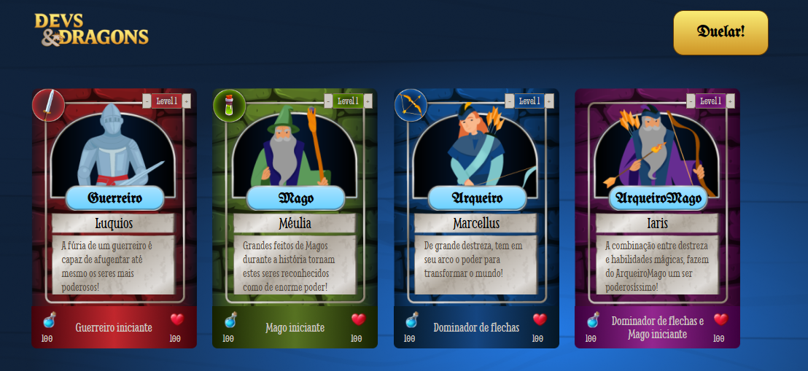
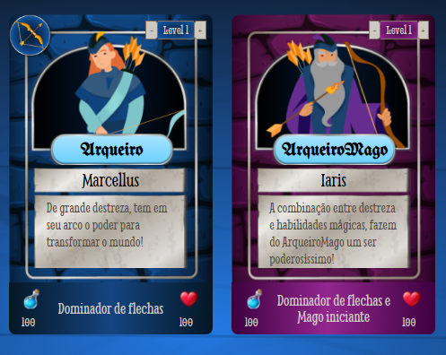
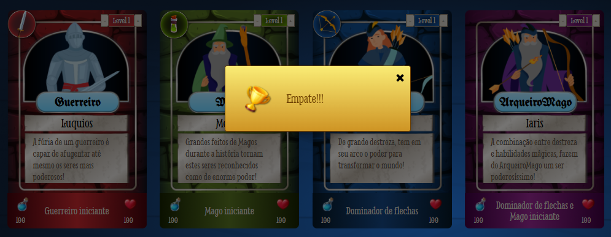

## 🐉 Devs&Dragons 🛡️

**Devs&Dragons** é um jogo de cartas inspirado no mundo de RPG, onde diferentes classes de personagens com habilidades únicas se enfrentam em batalhas estratégicas. Desenvolvido para praticar conceitos de **Orientação a Objetos** em JavaScript, o jogo destaca a criação de classes, herança e polimorfismo em um ambiente lúdico e divertido.

 

## 🚀 Sobre o Projeto

Este projeto foi desenvolvido durante o curso da Alura:

* "JavaScript: classes e heranças no desenvolvimento de aplicações com orientação a objetos"
  
No **Devs&Dragons**, você pode simular combates entre cartas de diferentes classes. O jogo foi desenvolvido para explorar conceitos de **Orientação a Objetos** como classes, herança, encapsulamento e polimorfismo em um contexto lúdico e estratégico.

## 📚 Objetivos do Curso

**👉 JavaScript: classes e heranças no desenvolvimento de aplicações com orientação a objetos**

* Aprender a **criar** classes no JavaScript;
* Saber como utilizar **extends** e **super** na **herança**;
* Sobrescrever métodos com **polimorfismo**;
* Utilizar parte de uma classe em outra com **composição**;
* Criar e acessar **propriedades e métodos estáticos**;
* Entender como criar **propriedades privadas** com o **encapsulamento**;
* Adicionar **getters** e **setters** às classes.

## 🛠️ Tecnologias Utilizadas

                                

## 🖼️ Visualização do Projeto

Uma prévia das principais funcionalidades do **Devs&Dragons**:

**🌐 Acesse o Projeto Online**

O projeto está disponível para visualização na **Vercel**. Clique no link abaixo para acessar:

**🏰 Tela Inicial**

Interface inicial onde o jogador inicia a partida.

**🃏 Escolha das Cartas**

Selecione as cartas dos personagens para o duelo.

**⚔️ Resultado do Duelo**

Veja o desfecho do combate entre os personagens selecionados.

